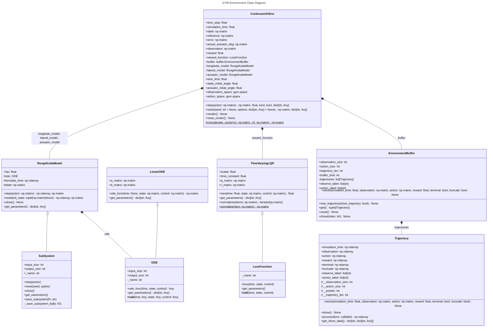

```mermaid
---
title: GYM Environment Class Diagram
---
classDiagram
    class SubSystem{
        +input_size: int
        +output_size: int
        +_name: str

        +step(action)*
        +reset(seed, option)*
        +close()*

        +get_parameters()*
        +save_subsystem(fn: str)
        -_save_subsystem_fp(fp: IO)
    }

    class RungeKuttaModel{
        +tau: float
        #ode: ODE
        #simulate_time: np.ndarray
        #state: np.matrix

        +step(action: np.matrix) np.ndarray, np.matrix
        +reset(init_state: tuple|np.matrix|None) np.ndarray, np.matrix
        +close() None

        +get_parameters() dict[str, Any]
    }

    class ODE{
        +input_size: int
        +output_size: int
        -_name: str

        +ode_func(time, state, control)* Any
        +get_parameters()* dict[str, Any]
        #__call__(time: Any, state: Any, control: Any)
    }

    class LinearODE{
        +a_matrix: np.matrix
        +b_matrix: np.matrix

        +ode_func(time: None, state: np.matrix, control: np.matrix) np.matrix
        +get_parameters() dict[str, Any]
    }

    class LossFunction{
        -_name: str

        +loss(time, state, control)*
        +get_parameters()*
        #__call__(time, state, control)
    }

    class TimeVaryingLQR{
        +scalar: float
        +time_constant: float
        +q_matrix: np.matrix
        +r_matrix: np.matrix

        +loss(time: float, state: np.matrix, control: np.matrix) float
        +get_parameters() dict[str, Any]
        +normalizes(items: np.matrix) Iterator[np.matrix]
        +normalize(item: np.matrix)$ np.matrix
    }

    RungeKuttaModel <|-- SubSystem
    LinearODE <|-- ODE
    TimeVaryingLQR <|-- LossFunction
    RungeKuttaModel *-- ODE: ode

    class Trajectory{
        +simulation_time: np.ndarray
        +observation: np.ndarray
        +action: np.ndarray
        +reward: np.ndarray
        +terminal: np.ndarray
        +truncate: np.ndarray
        +observe_label: list[str]
        +action_label: list[str]
        #__observation_size: int
        #__action_size: int
        #__pointer: int
        #__trajectory_len: int

        +store(simulation_time: float, observation: np.matrix, action: np.matrix, reward: float, terminal: bool, truncate: bool) None
        +show() None
        +process(func: callable) np.ndarray
        +get_show_data() dict[str, dict[str, Any]]
    }

    class EnvironmentBuffer{
        +observation_size: int
        +action_size: int
        +trajectory_len: int
        +buffer_limit: int
        -trajectories: list[Trajectory]
        +observe_label: list[str]
        +action_label: list[str]

        +store(simulation_time: float, observation: np.matrix, action: np.matrix, reward: float, terminal: bool, truncate: bool: None
        +new_trajectory(show_trajectory: bool) None
        +get() tuple[Trajectory]
        +reset() None
        +show(index: int) None
    }

    EnvironmentBuffer *-- Trajectory: trajectories

    class ContinueUAVEnv{
        %% ===== Physic attribute =====
        +time_step: float
        +simulation_time: float
        +state: np.matrix
        +reference: np.matrix
        +error: np.matrix
        +actual_actuator_deg: np.matrix

        %% ===== RL attribute =====
        +observation: np.matrix
        +reward: float
        +reward_function: LossFunction
        +buffer: buffer.EnvironmentBuffer

        %% ===== Dynamic model attribute =====
        +longitude_model: RungeKuttaModel
        +lateral_model: RungeKuttaModel
        +actuator_model: RungeKuttaModel

        %% ===== Boundary attribute =====
        +time_limit: float
        +state_initial_angle: float
        +actuator_initial_angle: float

        %% ===== GYM attribute =====
        +observation_space: gym.space
        +action_space: gym.space

        +step(action: np.matrix) np.matrix, float, bool, bool, dict[str, Any]
        +reset(seed: int = None, options: dict[str, Any] = None) np.matrix, dict[str, Any]
        +render() None
        +reset_render() None
        #concatenate_vector(v1: np.matrix, v2: np.matrix)$ np.matrix
    }

    ContinueUAVEnv *-- RungeKuttaModel: longitude_model, lateral_model, actuator_model
    ContinueUAVEnv *-- TimeVaryingLQR: reward_function
    ContinueUAVEnv *-- EnvironmentBuffer: buffer
```
